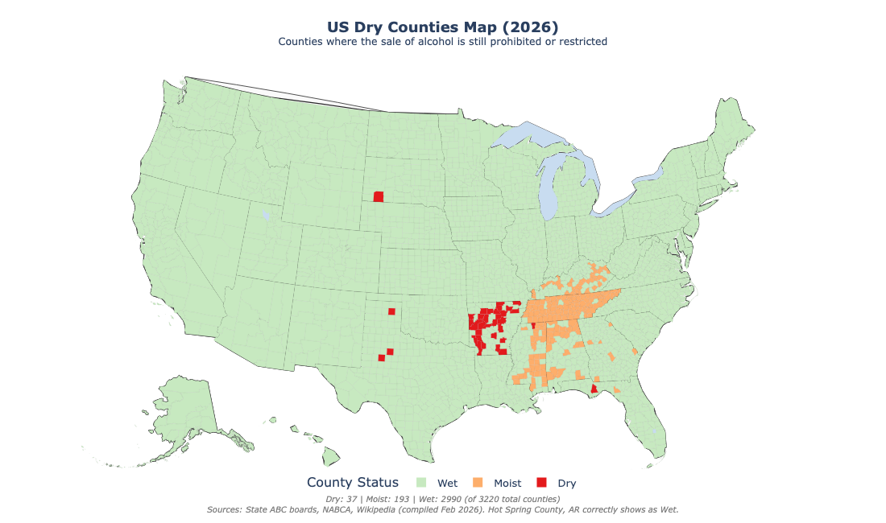

# US Dry Counties Map (2026)

An interactive choropleth map showing which US counties still prohibit or restrict alcohol sales, built as a modern open-source replacement for the [SAS-based dry counties map](https://blogs.sas.com/content/graphicallyspeaking/2019/07/08/which-counties-in-the-us-are-still-dry/) from 2019.

**[View the live map (GitHub Pages)](https://dblasing.github.io/dry-counties-map/dry_counties_map.html)** *(enable after publishing — see below)*



## Why This Exists

The widely-shared SAS map from 2019 (and the viral X/Twitter post based on it) is outdated. For example, it shows Hot Spring County, Arkansas as "dry" — but Hot Spring County voted to allow alcohol sales in November 2022 and has had liquor stores open since 2023. Many other counties have changed status since then.

This project recreates that map using Python and open-source tools, with data compiled from official state Alcohol Beverage Control (ABC) boards as of February 2026.

## Key Findings (vs. the 2019 SAS Map)

| Change | Detail |
|--------|--------|
| Hot Spring County, AR | Now **wet** (voted Nov 2022) |
| Kansas | **Zero** dry counties remain (Wallace County voted wet Nov 2025) |
| Texas | Down to **3** dry counties (Throckmorton voted wet Nov 2024) |
| Alabama | Zero *fully* dry counties (23 are "moist" with wet cities) |
| Virginia | Zero dry counties since 2020 |
| Mississippi | Only **1** fully dry county (Benton) |

## Current Totals

- **37** Dry counties (no alcohol sales at all)
- **193** Moist counties (some restrictions — wet cities in dry counties, beer-only, etc.)
- **2,990** Wet counties (standard unrestricted sales)

## Quick Start

```bash
# Install dependencies
pip install plotly pandas geopandas plotly-geo shapely

# Generate the interactive map
python3 dry_counties_map.py

# Open the result
open dry_counties_map.html    # macOS
xdg-open dry_counties_map.html  # Linux
start dry_counties_map.html   # Windows
```

The output is a self-contained HTML file with zoom, pan, and hover tooltips showing each county's name, state, and alcohol sales status.

## How It Works

1. **County boundaries** come from the US Census Bureau's 2016 county shapefiles, bundled with the `plotly-geo` Python package (no internet needed at runtime).

2. **Alcohol status data** is compiled from official state ABC boards and stored as a Python dictionary in the script. Counties are classified as:
   - **Dry**: No legal retail alcohol sales anywhere in the county
   - **Moist**: Some restrictions (e.g., wet cities within a dry county, beer-only, by-the-drink only)
   - **Wet**: Standard unrestricted sales (subject to normal state-level rules)

3. **The map** is generated with Plotly Express as an interactive choropleth, then saved as a standalone HTML file.

## Data Sources

| State | Source |
|-------|--------|
| Arkansas | AR GIS Office / ABC Division (Feb 2025) |
| Texas | TABC interactive wet/dry map (March 2025) |
| Kentucky | KY ABC / Cabinet for Economic Development |
| Mississippi | MS Dept of Revenue wet/dry map (Aug 2025) |
| Alabama | Alabama ABC Board wet cities list |
| Kansas | KS Dept of Revenue (Nov 2025) |
| Tennessee | TN Alcoholic Beverage Commission |
| Florida | FL Division of Alcoholic Beverages |
| Georgia | GA Dept of Revenue |
| South Dakota | State records |
| General | NABCA, Wikipedia |

## Updating the Data

County alcohol statuses change through local referendums. To update:

1. **Edit the Python dict** in `dry_counties_map.py` — find the `_build_status_map()` function and add/remove counties as needed.

2. **Run with `--update`** to attempt fetching from Wikipedia (scaffolded, not fully implemented yet — PRs welcome!):
   ```bash
   python3 dry_counties_map.py --update
   ```

3. **Re-run** to regenerate the map:
   ```bash
   python3 dry_counties_map.py
   ```

## Comparison to the Original SAS Code

| Feature | SAS (2019) | This Project |
|---------|-----------|--------------|
| Language | SAS (proprietary) | Python (open-source) |
| Map engine | PROC GMAP | Plotly Express |
| Interactivity | Mouse-over only | Zoom, pan, hover, scroll |
| Data format | Hardcoded in DATA steps | Python dict (easy to edit) |
| Output | SAS viewer | Standalone HTML (any browser) |
| Data vintage | ~2017-2019 | February 2026 |
| Cost | SAS license required | Free |

## Requirements

- Python 3.8+
- plotly
- pandas
- geopandas
- plotly-geo
- shapely

## Contributing

PRs welcome! Particularly useful contributions:

- **Data corrections**: If you know a county's status has changed, open an issue or PR with a source link.
- **Wikipedia scraper**: The `--update` flag is scaffolded but the parser isn't complete. Help build it out.
- **Additional states/territories**: Puerto Rico, Guam, etc. are not yet included.

## License

MIT
